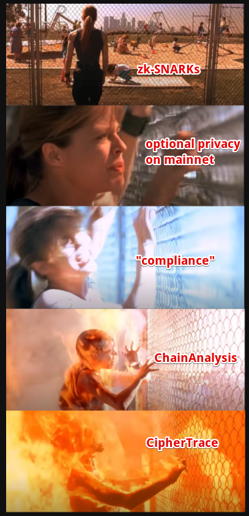
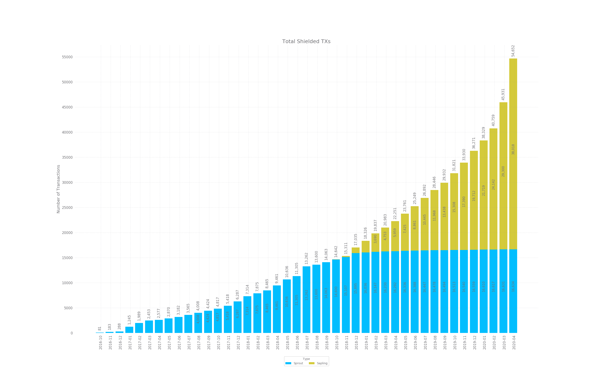

# Anonymity Sets in Zcash Protocol Cryptocoins

## TLDR

 * We exactly define anonymity sets (anonsets), AKA "shielded pools"
 * Most/all privacy coins seem unaware of the actual definition
 * [Hush](https://myhush.org) is currently the only cryptocoin that can calculate anonset in real-time
 * Detailed current statistics

## Zcash Privacy in 5 Acts

<a target="_blank" href="sarah-connor-dream-zcash.png"></a>

## What is an anonymity set?

An anonymity set, also called a "shielded pool" in [Zcash Protocol](https://github.com/zcash/zips/blob/master/protocol/protocol.pdf), is the set of
potential funds that could be part of a transaction. The anonymity set is exactly the feature
which adds privacy to a privacy coin. When a Zcash Protocol transaction is made, and shielded
funds are spent from a shielded address (zaddr), zero-knowledge mathematics is used to spend
the funds without leaking the metadata of *which* funds are being spent or where they came from.

Cryptocoins with very small anonymity sets seem like they have privacy, but in practice, they are
like a football stadium with only a few dozen people in the seats. All of them are very easy to
identify because there is no "crowd to hide in". After four years, Zcash mainnet has a very small
anonymity set and because they do not publish correct statistics about it, nor provide tools to
measure it in real-time.

It's likely that after just 1.5 years on our current mainnet, HUSH has a larger anonset than ZEC, but
again, it's unclear because they do not publish correct statistics nor provide tools at the full
node level to measure them in real-time.

## Anonymity sets of various coins

It's certain that [Pirate](https://pirate.black) (ARRR) has the largest Zcash Protocol anonymity set, even though most community members
are dumb-founded if you ask them to define what it is. It's likely that [Arrow](https://arrowchain.io) (ARW), a recent Pirate
competitor, has a larger anonset than Hush as well. This is a basic fact of z2z-only chains: they will
almost always have higher zaddr usage percentage and anonsets, since it's enforced at a consensus level.

In terms of Zcash Protocol coins which do not (yet) enforce z2z, the author believes Hush is currently
the coin with highest zaddr usage ([14.5% as of July 19th 2020](https://myhush.org/supply)) and largest anonset (about 93,000). 
When Hush enforces shielded only transaction in November 2020 at [Block 340,000](https://myhush.org/halving/) , we will join Pirate and
Arrow in being the only enforced-privcay Zcash Protocol coins.

Since no other coins can measure theirs in real-time, we implore Zcash, Pirate, Arrow and all Zcash Protocol coins to port the
Hush Shielded Index `-zindex` so that we can have industry-wide comparison of our privacy, in real-time. If we cannot
give our users and investors real-time detailed data about our privacy metrics, what kind of technology
are we really creating?


## Zcash + Hush Anonymity Sets

The anonymity set is a *set*, not a count! [Josh Swihart](https://twitter.com/jswihart/status/1273022506014834688) of Zcash Company does not seem to understand
the difference between a daily count of transactions and the current set of privacy.
They are completely different, yet he talks as if they are the same. All graphics
from Swihart and Zcash Company related to transaction counts are *NOT* anonymity sets counts.
They are transaction counts, which is not related directly to anonsets at all. It's possible
to have very high transaction counts and very small anonsets.

Zcash Company does not understand that the anonset can change with every block, and go up and down.
For instance, if I use 10 shielded spends but only create 1 shielded output, that transaction
will reduce the size of the anonset by 9, since 10 - 1 = 9.

<a target="_blank" href="zcash-ztxs.png"></a>

They show graphs of counts monotonically going up, attempting to lie (badly) with statistics.
Additionally, Zcash Company is running test scripts behind the scenes to massage their
incorrectly-defined data. For about 17 months, the blue bars of Sprout shielded transactions have
not increased or decreased noticeably but stay under 0.5% deviation month to month. This is almost
certainly automated software by Zcash Sprout fund owners to increase shielded statistics.

In the 30 days leading up to July 19th 2020, Hush had 40,180 Sapling shielded transactions, just over
the amount Zcash claims, of 38,016. We remind users that Hush was the very first Zcash Protocol coin
to remove the old Sprout addresses, which had a severe [inflation bug CVE-2019-7167](https://myhush.org/sapling/). Hush has no Sprout transactions
in it's history and in fact almost all Sprout code has been deleted from the Hush codebase, to reduce
potential attack surface of future bugs. It is the only coin which is able to claim these feats.

## Anonymity Set Size

The *size* of the anonset is a count, and we can measure it at every block with a very simple
equation:


```
    size(anonset) = outputs - spends
```

at a given block height `H`. It's good to remember, anonsets are functions of block height!
They go up and down with time. They go up when more outputs are created then inputs spent.
The opposite happens, the anonymity set *goes down* when more spends are consumed and sent
to a smaller number of outputs. Both of these types of shielded transactions happen normally
in plain Zcash Protocol.

At every block, the Hush full node keeps track of all shielded spends and outputs, so it can
calculate the size of the anonset at any block height. To our knowledge, Hush is the first
cryptocoin to ever have this ability. Additionally, the custom [Sietch](https://eprint.iacr.org/2020/627) technology invented
by Hush Developers ensures that no Hush transaction can reduce the size of the anonset. On
Hush mainnet, the size of our anonset can only stay the same, or increase.

Hush developers also believe that the Hush anonset *grows faster* than the Zcash, Arrow and
potentially the Pirate anonset. Since Hush migrated to a second mainnet about 1.5 years ago,
our statistics have had much less time to grow, compared to Pirate and Zcash mainnets. Our
Shielded Index let's us study this in real-time.

## Hush details

When the `-zindex` CLI argument is enabled, the Shielded Index keeps tracks of many
statistics, two of which are `shielded_spends` and `shielded_outputs`. This data can
be retrieved via:

```
    hush-cli getchaintxstats
```

This will return a large amount of [JSON data](https://gist.github.com/leto/8c02406464d61b43c2e5f0bbd9b8311d) where the current anonset size will be returned as
`shielded_pool_size` and can be verified as the differece between `shielded_outputs` and
`shielded_spends` .

## Current Stats

As of Hush Block Height 263573 on 19th July 2020:

  * Anonset Size     = 93559
  * Shielded Spends  = 38954
  * Shielded Outputs = 132513

What this means, is that every time you do a shielded Hush transaction, it's "hiding"
in the "anonymity set" of about 100,000 others, which gives us privacy. The larger the
anonset, the more privacy. If our anonset was just a small number, most privacy properties
are lost.

## Comparing to Monero/CryptoNote coins

The way privacy works in [Monero](https://getmonero.org)/[CryptoNote](https://cryptonote.org/) coins is different and the way anonymity set
is defined is different. With Monero, about 10 or so "mixins" are added to each transaction,
so that it's unclear exactly which funds are being spent. So the anonymity set of every Monero
transaction is a different small set of about 10, which constantly changes.

The author believes that Zcash Protocol anonymity sets are stronger, but concedes that Monero
has a much stronger dedication to privacy than Zcash and has better GUI wallets with great UI/UX.

For these reasons, Hush considers Monero to be it's main competition, as Zcash mainnet is now
supported by Chainanlysis and Ciphertrace.


## Questions

  * Why doesn't Zcash provide these stats in real-time?

The author proposes they realize it would be too depressing to see how small their anonset is, after four years. This is why Josh Swihart lies with statistics and tells investors whatever they want to hear.

  * Is Josh Swihart commiting financial fraud by knowingly misrepresenting ZEC mainnet statistics?

The author believes Electric Coin Company is purposefully misrepresenting numbers, grossly inept, or both.

# Conclusions

Zcash investors are being grossly lied to, with cooked statistics that border on outright lies, as well
as lies of omission about how the surveillance tech of ChainAnalysis and Ciphertrace actually work.

Electric Coin Company is part of the Military-Industrial-Surveillance complex, which involves all blockchain
analysis companies and the Law Enforcement/Government entities which pay them like an IT department. These
include but are not limited to:

  * FBI
  * CIA
  * ATF
  * DEA
  * IRS
  * US Secret Service
  * US Federal Marshalls
  * Department Of Homeland Security (includes ICE)
  * Interpol
  * Europol
  * State police
  * Local police

