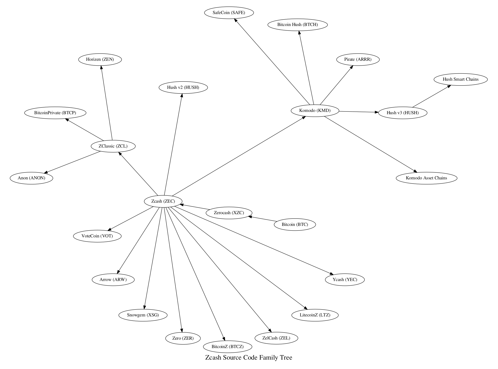

# Zcash Protocol Family Tree

Here we represent, for the first time that we know, a family tree of Zcash
Protocol coins which use Zcash source code. We note that Bitcoin Gold (BTG)
is not listed because they use the PoW algorithm from Zcash (Equihash) but
do not use any of the privacy-related code.

Zcash originally forked the source code of Bitcoin 0.11.2 and has cherry-picked
many individual fixes and features but primarily remains Bitcoin 0.11.2 internals
with brand new Zcash features bolted on top of that.

Notably, recent developments by Bitcoin Core to manage wallets via the RPC
interface is lacking in Zcash, as well as P2P improvements.

The category of "Komodo Asset Chains" contains dozens of blockchains which
have shielded transaction support. Hush Smart Chains are similar but focus
purely on Proof-of-Work (not Proof-of-Stake) use cases and are focused on
privacy-by-default use cases. This is sometimes calles "z2z" because sending
to zaddrs is required and sending from a zaddr to a transparent address is
not allowed.

It is easy to see that ZClassic has been used as a base for many new source
code and chain forks and that Komodo has creates a micro-universe of it's
own run-time, such as Pirate, and source code forks, such as Hush v3.
