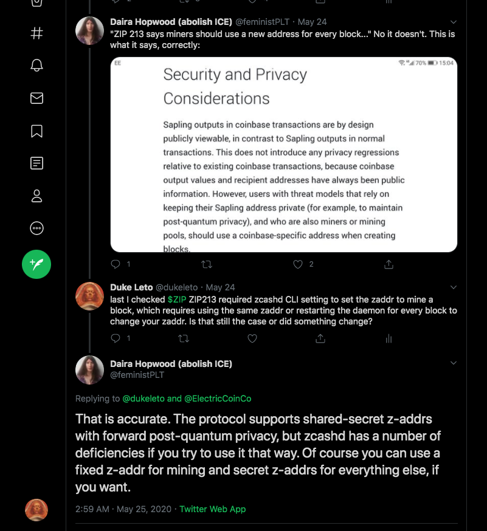

# Shielded Coinbase ZIP213 Considered Harmful

## TLDR

 * Shielded Coinbase (ZIP213) is new Zcash Protocol consensus change
 * It allows mining directly to a shielded address
 * This sounds good at first, but has many problems
 * It actually reduces privacy of miners, as [Duke Leto pointed out to the creator of Zcash Protocol](https://twitter.com/feministPLT/status/1264858630068875264)
 * Zcash is marketing this as a new feature, when it's really a bug

## What is Shielded Coinbase?

Firstly, what is coinbase? We are not talking about the evil company, we are talking about newly mined
coins. The internals of Bitcoin refers to this as "coinbase", which is a cool name and why the evil
company stole it, to make their vile KYC seem palatable.

Every cryptocoin has "coinbase", which are the brand new coins that come as the "block reward" in a new
block. All coinbase traditionally goes to a transparent address.

Shielded coinbase is a new feature of Zcash Protocol where a miner can choose to miner to a shielded address (zaddr)
instead of a transparent address (taddr). Sounds like a huge privacy win, right? At first glance, yes.
But then with further perusal, we will find that because of *how* Zcash Company chose to implement this feature
and because of some previous technical limitations, this feature will actually *reduce* privacy of the individual
miner and the shielded pool.

## Why does Shielded Coinbase reduce miner privacy?

At least two fundamental reasons conspire together to forcefully leak metadata when ZEC miners use ZIP213:

  * Miners must hardcode their zaddr via the command-line
  * Miners must make their zaddr public, in the block metadata

Because miners must set their zaddr when starting their node, it will be fixed until the next time the stop and restart.
This encourages miners to set one zaddr and mine to it for long periods of time, since changing it would require
stopping and restarting a node. Not only is that extra work, but you cannot mine while your node is restarting, so it
has a definite cost that can be calculated, per minute of downtime. Miners do not want downtime and hence they will
not use the feature correctly.

The first issue could be fixed with technical changes, but most likely will not, because ZIP213 was meant mostly
for marketing purposes and not for increasing chain privacy.

## Shielded Coinbase Is Optimized for Auditability

Zcash Company wrote this feature with maximal auditability in mind, which is why privacy suffers so badly. The Hush community
feels that optimizing for this defeats the entire purpose of the technology.

Auditibility means that the address being mined to is public, and it's public how much is being mined and at what time, because
mining data is public.

Since Zcash refuses to enforce privacy on their mainnet and only 5% of funds use privacy features, it makes sense for Zcash
mainnet to have ZIP213. There is no privacy anyway.

The Komodo and Hush communities will not be implementing ZIP213 in any of our blockchains, because we feel it's a privacy
regression rather than improvement.

## ZIP213 Hurts The Entire Shieded Pool

Not only does using this "feature/bug" from ECC hurt the individual miner, but it hurts the entire privacy of Zcash mainnet.
As a chain analysis company, Shielded Coinbase provide extra metadata to link owners of taddrs and zaddrs together.

Normally, a miner receives funds to a taddr, *then* send to a zaddr. This is a very privacy-perserving process, as the zaddr
NEVER APPEARS PUBLICLY.

With ZIP213, a miner PUBLISHES their zaddr (something the Hush community considers extremely bad for privacy) and then procedes
to publicize various transactions that miner finds to that zaddr. It's similar to saying "this is my z2z transaction id and also
the amounts that were involved and the address", which basically removes all privacy.

Even if funds are then moved again to another zaddress, chain analysis companies will use this historical data to correlate
which miners sold to which exchanges that were then used later on in various transactions. The metadata infects the blockchain
history *forever*.

Not only does this happen once, but it happens *continuously*, a stream of metadata leakage, as a miner uses ZIP213 and does
not change their zaddr. Zcash chose to do this *on purpose* for supply audit reasons, but it ends up ruining any kind of 
improvement to privacy.

## Shielded Mining Pool Payouts

We want to clarify that we are talking about solo miners and mining pools receiving block rewards directly from the blockchain,
not pool miners getting payouts. Getting paid out to a shielded address is very good for privacy! Everything here is specific
to Shielded Coinbase, and miners who are getting payouts to zaddrs all good. Those payouts do not expose their addresses publicly, unlike Shielded Coinbase.

## Conclusions

 * Don't solo mine directly to a zaddr on any blockchain.
 * Mine to a taddr, then send to a zaddr, while keeping your zaddr private.
 * Question anything coming from Zcash Foundation + ECC
 * Hush and Komodo will not implement Shielded Coinbase, it's bad for privacy
 * If Zcash truly cared about privacy, they would enforce usage of shielded addresses
